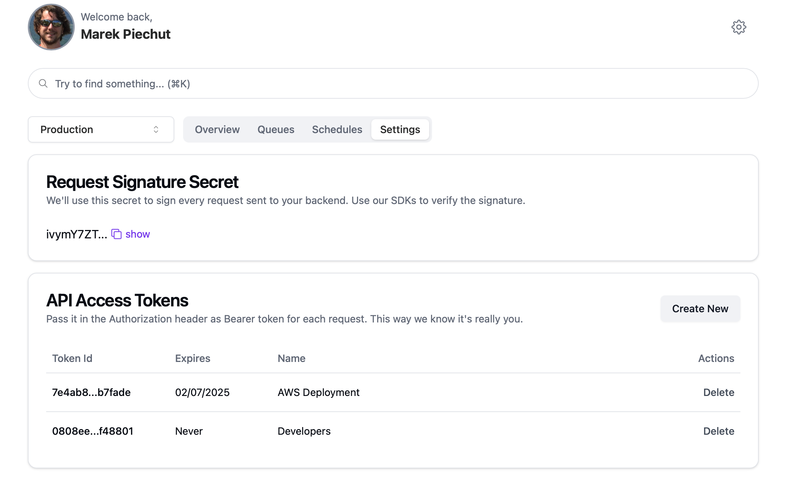
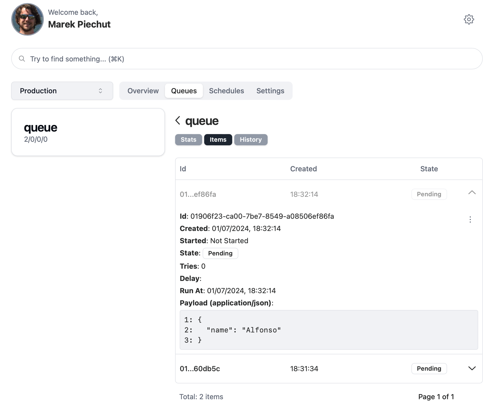
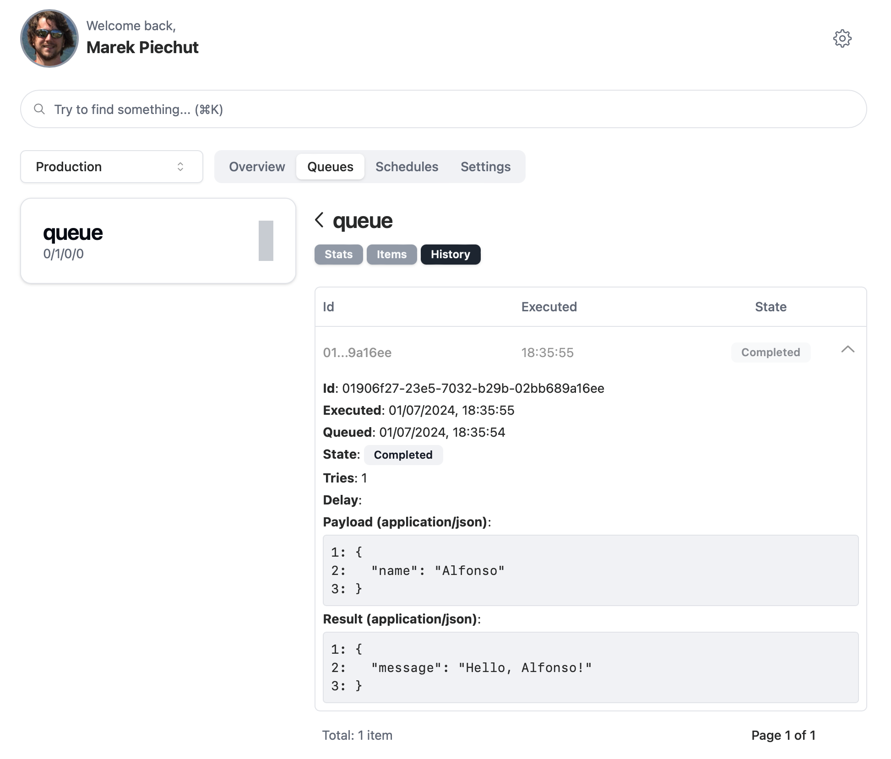

# LambdaQueue quickstart guide

In this section we'll build a simple echo queue that will test that your integration with LambdaQueue works. This will get you a skeleton you can
use to build your async application.

## Step 1 - Generate Access Keys

First thing we need it to get two security keys:

- **signature secret** - LambdaQueue uses it to sign all requests when calling your service. This way you're sure it's us, not some attacker calling your service.
  that)
- **API token** - You'll use it to authorize your calls to LambdaQueue API, this way we know that it's you that is really calling our APIs.

To get these just go to [Settings](https://app.lambdaqueue.com/settings) section in admin UI.
Signature secret should be generated for you. There can only be one for given environment.
For **API tokens**, you are free to generate as many as you want. All will work until they expire or you delete them.

> [!IMPORTANT]
> 🚨**Make sure you copy API key when it's generated. For security reasons you won't be able to see it again.**



> [!TIP]
> It's a good practice to have a separate API key for deployment environment, developers, system administrators, etc.
> This way you can delete leaked dev key without compromising your production.

## Step 2 - Setup Env

There are 2 ways you can use generated keys in LambdaQueue - via configuration options when loading SDK or via env variables.
We recommend you use second option: store your keys in env variables according to your framework/server documentation:

```bash [.env]
LQ_SECRET=_signature_secret_
LQ_TOKEN=_api_token_
LQ_BASE_URL=_public_url_ #So LambdaQueue can connect your app
```

## Step 3 - Add SDK for your framework

::: code-group

```bash [Next.js]
npm add @dayone-labs/lambda-queue-serverless
```

```bash [Express/Connect]
npm add @dayone-labs/lambda-queue-connect
```

:::

## Step 4 - Create a simple echo queue

::: code-group

```typescript [Next.js]
import { queue } from '@dayone-labs/lambda-queue-serverless'

export const welcomeQueue = queue(
  '/welcome-queue', //Pass route that it will be served at❗
  async (job: { name: string }) => {
    return { message: `Hello, ${name}` }
  }
)

//Queue is a route handler, just expose it as POST
export const POST = welcomeQueue
//Remember to expose HEAD so we can validate endpoint
export const HEAD = welcomeQueue

//Push to queue anywhere in your code
await welcomeQueue.push({ name: 'Alfonso' })
```

```typescript [Express]
import lq from '@dayone-labs/lambda-queue-express'
import express from 'express'

const app = express()
const queue = lq.queue('/welcome-queue', async (event: { name: string }) => {
  return { message: `Hello, ${name} ` }
})

app.use(queue)
app.use(express.json())

//Push to queue anywhere in your code
await queue.push({ name: 'Alfonso' })
```

:::

## Step 5 - Item processed

After pushing to queue, if you're quick, you can check in [Admin UI](https://app.lambdaqueue.com/queues/welcome-queue/items) that
your item was queued for processing.



After few seconds, LambdaQueue servers will pick up the task and process it. Afterwards it will be visible in [queue history](https://app.lambdaqueue.com/queues/welcome-queue/history),
with value you have returned from your service displayed in "Result" section.



## The End

Feel free to play with the code. Use other queues, do some asynchronous processing, return an error or some other payload.
You can also check out [Examples](/examples/) section for if you want to get some ideas how you can use LambdaQueue in your code.
